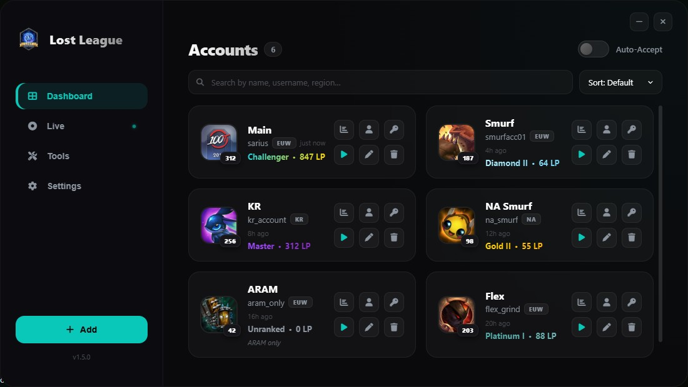

<div align="center">
  
  <h1>Lost League Manager</h1>
  <p>A lightweight Windows utility for managing multiple League of Legends accounts</p>

  <a href="https://github.com/mauricekleindienst/lost-league-manager/releases/latest">
    
  </a>
  &nbsp;
  <a href="https://github.com/mauricekleindienst/lost-league-manager/releases">
    
  </a>
  &nbsp;
  <a href="https://github.com/mauricekleindienst/lost-league-manager/actions/workflows/release.yml">
    
  </a>
  &nbsp;
  

  <br><br>
  
</div>

---

## Features

### Account Management
- **One-click login** — stores multiple accounts and handles the entire login flow automatically
- **Machine-bound encryption** — passwords are encrypted with AES-256 using a key derived from your hardware, never stored in plain text
- **Copy username / password** — clipboard buttons on every card for quick access
- **Account profiles** — view rank, LP, win rate, and match history per account
- **Search & sort** — filter by name, tag, region; sort by rank, name, region, or last used
- **Backup & restore** — export all accounts to a portable `.llem` file and import on any machine

### League Client Integration
- **Live view** — shows your active summoner's ranked stats, champion mastery, and recent match history in real time
- **Auto-accept** — automatically clicks Accept when a match is found
- **Auto random skin** — picks a random owned skin at champion select
- **Appear offline** — launches the client with hidden online status
- **Dodge queue** — one-click queue dodge from within the app
- **Client language** — change the League client language without reinstalling
- **Minimize on game start** — hides the app to the system tray when a match begins

### Tools
- **Kill Processes** — emergency kill for all Riot/League processes
- **Repair Client** — removes the lockfile to fix "client won't start" without closing a running game
- **Clear Cache** — wipes the Riot Client CEF cache to fix broken UI and stuck loading screens
- **Open Data Folder** — quick access to the app's config and accounts directory

### App
- **Auto-updates** — downloads and installs new versions silently in the background
- **System tray** — minimizes to tray with a jump list for instant account access
- **Accounts Backup** — export/import accounts to a portable encrypted file

---

## Installation

1. Download `Lost-League-Manager-Setup.exe` from the **[latest release](https://github.com/mauricekleindienst/lost-league-manager/releases/latest)**
2. Run the installer
3. Launch **Lost League Manager** from your desktop or Start Menu

> **Windows SmartScreen warning?** Right-click the installer → Properties → check **Unblock** → Apply → run again.
> This is expected for unsigned apps. The source code is fully open here.

---

## Usage

| Action | How |
|---|---|
| Add account | Click **+** in the sidebar, fill in username, password, region |
| Launch account | Click any account card or the play button |
| Copy credentials | Use the user/key icon buttons on each card |
| Auto-accept | Toggle the switch in the header or Settings |
| Live stats | Click **Live** in the sidebar (requires League client open) |
| Backup accounts | Settings → Accounts Backup → Export |
| Tools | Click **Tools** in the sidebar |

> **Important:** Do not move your mouse or keyboard during the auto-login sequence — the app types your credentials directly into the client.

---

## Building from Source

```bash
# Clone
git clone https://github.com/mauricekleindienst/lost-league-manager.git
cd lost-league-manager

# Install dependencies
npm install

# Dev mode
npm start

# Build installer
npm run build
```

Requires **Node.js 20+** and **Windows** (the app uses Windows-only APIs for credential injection).

---

## Tech Stack

| Layer | Technology |
|---|---|
| Shell | [Overwolf Electron](https://overwolf.github.io/ow-electron/) |
| Auto-update | electron-updater |
| LCU API | WebSocket + REST over localhost |
| Encryption | Node.js `crypto` — AES-256-CBC, machine-bound key |
| HTTP | axios |

---

## Disclaimer

Lost League Manager is an unofficial fan-made utility and is **not affiliated with or endorsed by Riot Games**. League of Legends is a trademark of Riot Games, Inc. Use at your own risk and in accordance with Riot's Terms of Service.
